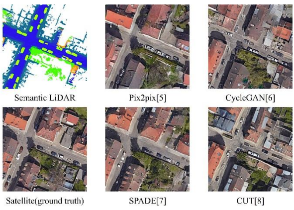
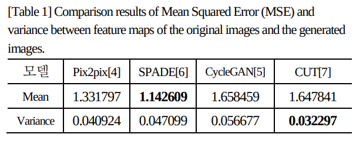

# Compare_GANs_for_Cross-Modal_Place-Recognition

"교차 모달 장소 인식을 위한 생성 모델의 비교 및 분석", KRoC 2024  
This repository conducted research on comparing and analyzing to select a suitable generative model for performing cross-modal place recognition between visual and LiDAR sensors.
We compared Pix2pix, CycleGAN, CUT, and SPADE models, using the difference between VGG16 feature maps as the comparison criterion.

### Abstract
Overcoming the constraints of diverse sensor modalities is crucial for effective place recognition in multi-robot systems. However, achieving cross-modal place recognition to bridge the gap between different sensor modalities remains a challenging task. In this study, we investigated suitable generative models to transform lidar maps into aerial view images. We conducted a thorough comparison of four representative generative models: Pix2pix, CycleGAN, CUT, and SPADE. Through this comprehensive analysis, we carefully assessed and selected the most suitable model for cross-modal place recognition. To evaluate the applicability of the generated images in the context of cross-view geo-localization, we compared the similarity of their feature maps with those of actual aerial view images. The experimental results unequivocally demonstrated that the SPADE model outperformed its counterparts, with feature maps of the generated images closely aligning with those of actual aerial view images.

### Experimental Results
**Generated images**

  

**Comparison results**

  

